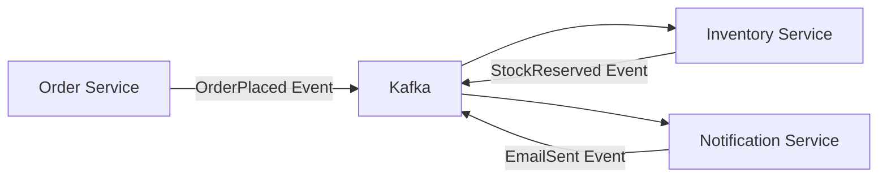

# 🛒 E-Commerce Microservices Platform

> **⚠️ This project is currently under construction.**

A modern, cloud-native e-commerce platform built with **microservices
architecture** using **NestJS**, **TypeScript**, and **Docker**. Designed for
high performance, scalability, and enterprise-grade reliability with
event-driven communication and comprehensive monitoring.

## 🏗️ Architecture Overview

This platform implements **Domain-Driven Design (DDD)** with independent,
loosely-coupled microservices communicating through **event-driven
architecture**:

### Core Services

| Service              | Purpose                                     | Database             | Cache          | Events                    |
| -------------------- | ------------------------------------------- | -------------------- | -------------- | ------------------------- |
| 🔐 **Auth**          | Authentication, Registration, User Profiles | PostgreSQL           | Redis Sessions | User events               |
| 📦 **Catalog**       | Product CRUD, Categories, Search            | PostgreSQL + MongoDB | Redis Cache    | Product events            |
| 🛒 **Orders**        | Cart, Order Placement, History              | PostgreSQL           | Redis Cache    | OrderPlaced, OrderUpdated |
| 💳 **Payments**      | Stripe/PayPal Integration                   | PostgreSQL           | —              | PaymentProcessed          |
| 📊 **Inventory**     | Stock Management, Reservations              | PostgreSQL           | Redis Cache    | StockUpdated              |
| 📧 **Notifications** | Email/SMS via Twilio/SendGrid               | PostgreSQL           | —              | All service events        |

### Communication Pattern



## 🚀 Technology Stack

### **Core Framework**

- **NestJS** - Enterprise-grade Node.js framework with dependency injection
- **TypeScript** - Type-safe development with compile-time error checking
- **Prisma ORM** - Type-safe database queries with auto-generated client

### **Data Layer**

- **PostgreSQL** - Primary ACID-compliant database for transactional data
- **MongoDB** - Document storage for product reviews and flexible schemas
- **Redis** - High-performance caching for sessions and frequently accessed data
- **Elasticsearch** - Full-text search engine for product catalog

### **Event Streaming & Communication**

- **Apache Kafka** - Distributed event streaming platform for service
  communication
- **REST APIs** - Synchronous communication for real-time operations
- **Event Sourcing** - Audit trail and eventual consistency patterns

### **Infrastructure & DevOps**

- **Docker & Docker Compose** - Containerization for consistent environments
- **Kubernetes** - Container orchestration with auto-scaling and load balancing
- **Traefik** - Cloud-native API gateway with automatic service discovery
- **GitHub Actions** - CI/CD pipeline with automated testing and deployment

### **Monitoring & Observability**

- **Prometheus** - Metrics collection and alerting
- **Grafana** - Real-time dashboards and visualization
- **ELK Stack** (Elasticsearch, Logstash, Kibana) - Centralized logging
- **Health Checks** - Service availability monitoring

### **Security & Quality**

- **JWT Authentication** - Stateless token-based security
- **Input Validation** - Request sanitization and validation
- **HTTPS/TLS** - End-to-end encryption
- **ESLint + Prettier** - Code quality and consistent formatting
- **Husky** - Pre-commit hooks for quality gates

## 🎯 Key Features & Capabilities

### **Microservices Benefits**

- ✅ **Independent Scaling** - Scale services based on demand
- ✅ **Technology Diversity** - Use best tools for each service
- ✅ **Fault Isolation** - Service failures don't cascade
- ✅ **Team Autonomy** - Independent development and deployment

### **Event-Driven Architecture**

- ✅ **Loose Coupling** - Services communicate via events, not direct calls
- ✅ **Eventual Consistency** - Data consistency across service boundaries
- ✅ **Audit Trail** - Complete event history for debugging and compliance
- ✅ **Scalable Processing** - Handle high-volume event streams

### **Production-Ready Features**

- ✅ **Auto-Scaling** - Kubernetes horizontal pod autoscaling
- ✅ **Load Balancing** - Intelligent traffic distribution
- ✅ **Circuit Breakers** - Prevent cascade failures
- ✅ **Rate Limiting** - API protection against abuse
- ✅ **Caching Strategy** - Multi-level caching for performance
- ✅ **Service Discovery** - Dynamic service registration and discovery

## 🚀 Quick Start

### Prerequisites

- **Node.js** >= 18.0.0
- **Docker** & Docker Compose
- **Git**
- **kubectl** (for Kubernetes deployment)

### Installation & Setup

```bash
# Clone the repository
git clone https://github.com/Aziz-ur/ecommerce-microservices.git
cd ecommerce-microservices

# Install dependencies
npm install

# Start infrastructure services (PostgreSQL, Redis, Kafka, etc.)
npm run docker:infra

# Verify infrastructure health
npm run health:check
```

### Development Workflow

```bash
# Start all services in development mode
npm run docker:up

# View real-time logs
npm run docker:logs

# Start specific service stacks
npm run docker:auth-stack        # Auth + dependencies
npm run docker:catalog-stack     # Catalog + search + messaging
npm run docker:orders-stack      # Orders + messaging

# Database operations
npm run db:migrate              # Run migrations across all services
npm run db:seed                 # Seed with sample data
npm run db:shell:auth           # Connect to auth database
npm run db:shell:catalog        # Connect to catalog database

# Code quality & testing
npm run lint                    # Lint all code
npm run format                  # Format with Prettier
npm run type-check              # TypeScript validation
npm run test                    # Run all tests
npm run commit                  # Conventional commit helper
```

## ⚡ TurboRepo Monorepo Management

This project leverages **TurboRepo** for high-performance monorepo build
orchestration, providing intelligent caching, parallel execution, and optimized
development workflows.

### **Why TurboRepo?**

- ⚡ **10x Faster Builds** - Intelligent caching across the entire monorepo
- 🔄 **Incremental Builds** - Only rebuild what changed
- ⚖️ **Parallel Execution** - Run tasks across multiple services simultaneously
- 📊 **Build Analytics** - Detailed insights into build performance
- 🎯 **Task Dependencies** - Automatic dependency resolution between services

### **TurboRepo Commands**

```bash
# Build all services and packages
turbo build

# Run in development mode with hot reload
turbo dev

# Lint all code across the monorepo
turbo lint

# Run tests for all services
turbo test

# Type-check across all TypeScript projects
turbo type-check

# Build specific workspace
turbo build --filter=auth

# Build service and its dependencies
turbo build --filter=catalog...

# Run multiple tasks in parallel
turbo build lint test
```

### **Caching & Performance**

TurboRepo provides intelligent caching based on:

- **Source Code Changes** - Only rebuild changed services
- **Dependency Updates** - Invalidate cache when dependencies change
- **Environment Variables** - Cache per environment configuration
- **Git History** - Leverage git for change detection

```bash
# Check cache hit rates
turbo build --dry-run

# Force rebuild ignoring cache
turbo build --force

# Clear cache
turbo clean
```

### **Workspace Filtering**

```bash
# Work with specific services
turbo dev --filter=auth                    # Run only auth service
turbo test --filter=catalog                # Test only catalog service
turbo build --filter=orders...             # Build orders and dependencies
turbo lint --filter=./apps/*               # Lint all apps
turbo type-check --filter=./packages/*     # Type-check shared packages
```

### **Development Workflows**

```bash
# Start development for specific service stack
turbo dev --filter=auth...                 # Auth + its dependencies
turbo dev --filter=catalog...              # Catalog + search + messaging deps

# Run tests for changed files only
turbo test --filter=[HEAD^1]               # Test changes since last commit

# Parallel development across teams
turbo dev --filter=auth,catalog,orders     # Multiple services
```

### **Build Pipeline Optimization**

The `turbo.json` configuration ensures optimal build order:

```json
{
  "pipeline": {
    "build": {
      "dependsOn": ["^build", "type-check"], // Build dependencies first
      "outputs": ["dist/**"] // Cache build outputs
    },
    "dev": {
      "cache": false, // Don't cache dev mode
      "persistent": true, // Keep running
      "dependsOn": ["db:up"] // Ensure database is ready
    },
    "test": {
      "dependsOn": ["^build"], // Test after build
      "outputs": ["coverage/**"] // Cache test results
    }
  }
}
```

### **CI/CD Integration**

TurboRepo optimizes CI/CD by:

- **Affected Services Detection** - Only test/build changed services
- **Remote Caching** - Share cache across CI runners
- **Parallel CI Jobs** - Run independent services in parallel

```yaml
# GitHub Actions with TurboRepo
- name: Build affected services
  run: turbo build --filter=[HEAD^1]

- name: Test affected services
  run: turbo test --filter=[HEAD^1]
```

### **Remote Caching (Production)**

Enable remote caching for team collaboration:

```bash
# Login to Vercel for remote caching
npx turbo login

# Link repository for shared cache
npx turbo link

# Build with remote cache
turbo build --team=your-team
```

### **Monorepo Best Practices**

1. **Service Independence** - Each service has its own `package.json`
2. **Shared Dependencies** - Common utilities in `packages/` directory
3. **Consistent Scripting** - Same script names across all services
4. **Incremental Adoption** - Add services gradually to the monorepo
5. **Cache Optimization** - Configure appropriate inputs/outputs for caching

## 📁 Project Structure

```
ecommerce-microservices/
├── 📁 apps/                    # Microservices Applications
│   ├── auth/                   # 🔐 Authentication & User Management
│   ├── catalog/                # 📦 Product Catalog & Search
│   ├── orders/                 # 🛒 Order Processing & Cart
│   ├── payments/               # 💳 Payment Gateway Integration
│   ├── inventory/              # 📊 Stock & Inventory Management
│   └── notifications/          # 📧 Email/SMS Notification Service
├── 📁 packages/                # Shared Libraries & Utilities
│   ├── types/                  # 📝 Shared TypeScript Definitions
│   ├── shared/                 # 🔧 Common Utilities & Helpers
│   └── config/                 # ⚙️ Configuration Management
├── 📁 k8s/                     # Kubernetes Deployment Manifests
│   ├── dev/                    # Development environment
│   ├── prod/                   # Production environment
│   ├── namespaces/             # Namespace definitions
│   ├── configmaps/             # Configuration maps
│   └── secrets/                # Secret management
├── 📁 scripts/                 # Utility & Automation Scripts
├── 📁 monitoring/              # Observability Configuration
│   ├── grafana/                # Grafana dashboards
│   └── prometheus/             # Prometheus rules & config
└── 📁 docs/                    # Project Documentation
```

## 🛠️ Development Guide

### Creating a New Microservice

```bash
# 1. Create service directory
mkdir apps/new-service
cd apps/new-service

# 2. Initialize NestJS application
npx @nestjs/cli new . --package-manager npm

# 3. Add Prisma for database
npm install prisma @prisma/client
npx prisma init

# 4. Configure service in docker-compose.override.yml
# 5. Add database configuration in scripts/init-multiple-dbs.sql
# 6. Update package.json scripts for the new service
```

### Event-Driven Communication Example

```typescript
// Producer (Order Service)
@Injectable()
export class OrderService {
  constructor(private readonly eventBus: EventBus) {}

  async createOrder(orderData: CreateOrderDto) {
    const order = await this.orderRepository.save(orderData);

    // Emit event for other services
    await this.eventBus.publish(
      new OrderCreatedEvent({
        orderId: order.id,
        userId: order.userId,
        items: order.items,
        total: order.total,
      })
    );

    return order;
  }
}

// Consumer (Inventory Service)
@EventsHandler(OrderCreatedEvent)
export class OrderCreatedHandler {
  async handle(event: OrderCreatedEvent) {
    // Reserve inventory for order items
    await this.inventoryService.reserveItems(event.items);

    // Emit inventory updated event
    await this.eventBus.publish(
      new InventoryReservedEvent({
        orderId: event.orderId,
        items: event.items,
      })
    );
  }
}
```

## 🔧 Infrastructure & Deployment

### Local Development Environment

- **API Gateway**: `http://localhost` (Traefik)
- **Traefik Dashboard**: `http://localhost:8080`
- **PostgreSQL**: `localhost:5432`
- **MongoDB**: `localhost:27017`
- **Redis**: `localhost:6379`
- **Kafka**: `localhost:9092`
- **Elasticsearch**: `localhost:9200`
- **Prometheus**: `http://localhost:9090`
- **Grafana**: `http://localhost:3000` (admin/admin)

### Service Endpoints (when running)

- **Auth Service**: `http://localhost:3001/api/docs`
- **Catalog Service**: `http://localhost:3002/api/docs`
- **Orders Service**: `http://localhost:3003/api/docs`
- **Payments Service**: `http://localhost:3004/api/docs`
- **Inventory Service**: `http://localhost:3005/api/docs`
- **Notifications Service**: `http://localhost:3006/api/docs`

### Kubernetes Deployment

```bash
# Deploy to development environment
npm run k8s:dev:deploy
npm run k8s:dev:status

# Deploy to production environment
npm run k8s:prod:deploy
npm run k8s:prod:status

# Monitor deployment
kubectl get pods -n ecommerce-dev
kubectl logs -f deployment/auth-service -n ecommerce-dev
```

### Docker Commands Reference

```bash
# Infrastructure management
npm run docker:core          # PostgreSQL + Redis only
npm run docker:storage       # + MongoDB
npm run docker:search        # + Elasticsearch
npm run docker:messaging     # + Kafka + Zookeeper

# Service-specific stacks
npm run docker:auth-stack    # Minimal stack for auth development
npm run docker:catalog-stack # Full stack for catalog (search + events)
npm run docker:orders-stack  # Orders with event processing

# Production deployment
npm run docker:prod:build    # Build production images
npm run docker:prod:up       # Deploy production stack
npm run docker:prod:down     # Stop production stack
```

## 🧪 Testing Strategy

### Testing Pyramid

```bash
# Unit Tests (Fast, Isolated)
npm run test --workspace=apps/auth
npm run test --workspace=apps/catalog

# Integration Tests (Service Communication)
npm run test:integration

# End-to-End Tests (Full User Journeys)
npm run test:e2e

# Load Testing (Performance Validation)
npm run test:load
```

### Test Coverage & Quality Gates

- **Minimum Coverage**: 80% for all services
- **Pre-commit Hooks**: Lint, format, and type-check
- **CI Pipeline**: Automated testing on every PR
- **Contract Testing**: API contract validation between services

## 📊 Monitoring & Observability

### Key Metrics Tracked

- **Business Metrics**: Orders/minute, Revenue, Conversion rates
- **Application Metrics**: Response time, Error rate, Throughput
- **Infrastructure Metrics**: CPU, Memory, Disk usage
- **Custom Metrics**: Cart abandonment, Search queries, User sessions

### Alerting & Incident Response

- **Prometheus Alerts**: Service health, performance thresholds
- **Grafana Dashboards**: Real-time system overview
- **Log Aggregation**: Centralized error tracking and debugging
- **Health Checks**: Automated service availability monitoring

## 🚢 Deployment & CI/CD

### Automated Pipeline

1. **Code Push** → GitHub Actions triggered
2. **Quality Gates** → Lint, test, security scan
3. **Build** → Docker images with SHA tags
4. **Deploy** → Staging environment
5. **Integration Tests** → End-to-end validation
6. **Production Deploy** → Blue-green deployment
7. **Monitoring** → Health checks and alerts

### Staging vs Production

```bash
# Staging deployment (develop branch)
npm run deploy:staging

# Production deployment (main branch)
npm run deploy:production

# Rollback capability
npm run rollback:production
```

## 🤝 Contributing

We welcome contributions! Please follow these guidelines:

### Development Process

1. **Fork** the repository
2. **Create feature branch**: `git checkout -b feature/amazing-feature`
3. **Follow conventions**: Use conventional commits (`npm run commit`)
4. **Write tests**: Maintain test coverage above 80%
5. **Update docs**: Include relevant documentation
6. **Submit PR**: Detailed description with testing instructions

### Commit Message Format

```
feat(catalog): add product search with filters
fix(auth): resolve JWT token expiration issue
docs(readme): update deployment instructions
refactor(orders): optimize cart calculation logic
```

### Code Quality Standards

- **TypeScript**: Strict mode enabled
- **ESLint**: Zero warnings allowed
- **Prettier**: Consistent code formatting
- **Tests**: Unit + integration coverage
- **Documentation**: API docs with examples

## 📈 Roadmap

### Phase 1: Core Services (Current)

- [x] Project setup and infrastructure
- [x] Docker development environment
- [x] CI/CD pipeline foundation
- [ ] Auth service implementation
- [ ] Product catalog service
- [ ] Order management service

### Phase 2: Advanced Features

- [ ] Payment processing integration
- [ ] Inventory management with reservations
- [ ] Real-time notifications
- [ ] Advanced search with filters
- [ ] Recommendation engine

### Phase 3: Scale & Optimize

- [ ] Kubernetes production deployment
- [ ] Auto-scaling policies
- [ ] Performance optimization
- [ ] Advanced monitoring & alerting
- [ ] Multi-region deployment

### Phase 4: Enterprise Features

- [ ] Multi-tenant support
- [ ] Advanced analytics
- [ ] A/B testing framework
- [ ] Machine learning integration
- [ ] Mobile API optimization

## 📚 Documentation

- [🏗️ Architecture Guide](docs/ARCHITECTURE.md) - System design and patterns
- [🔌 API Documentation](docs/API.md) - Service endpoints and contracts
- [🚀 Deployment Guide](docs/DEPLOYMENT.md) - Production deployment instructions
- [🧪 Testing Guide](docs/TESTING.md) - Testing strategies and frameworks
- [🔧 Development Setup](docs/DEVELOPMENT.md) - Local development environment
- [📊 Monitoring Guide](docs/MONITORING.md) - Observability and alerting

## 📝 License

This project is licensed under the **MIT License** - see the [LICENSE](LICENSE)
file for details.

## 📞 Support & Community

### Get Help

- 📧 **Email**: your-email@example.com
- 🐛 **Issues**:
  [GitHub Issues](https://github.com/Aziz-ur/ecommerce-microservices/issues)
- 💬 **Discussions**:
  [GitHub Discussions](https://github.com/Aziz-ur/ecommerce-microservices/discussions)
- 📖 **Documentation**:
  [Project Wiki](https://github.com/Aziz-ur/ecommerce-microservices/wiki)

### Connect

- 💼 **LinkedIn**:
[Your LinkedIn](https://www.linkedin.com/in/azizur-rahman-faisal/)
<!-- - 🌐 **Website**: [yourwebsite.com](https://yourwebsite.com) -->

---

<div align="center">

**Built with ❤️ by [Your Name](https://github.com/Aziz-ur)**

🙏 **Support This Project:**

⭐ **Star this repository** • 🔄 **Share with others** • 🐛 **Report issues**

💼 **Interested in collaboration?** Email: a.r.faisal13@gmail.com

</div>
